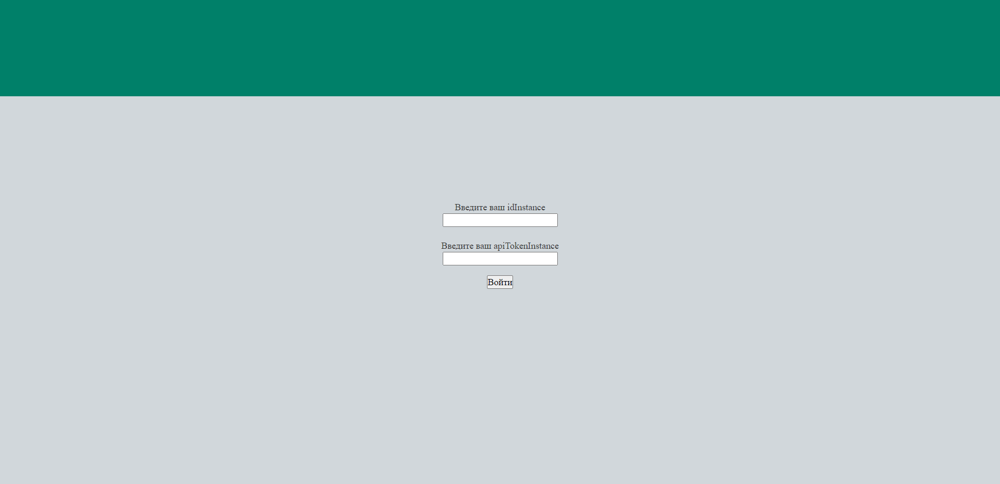
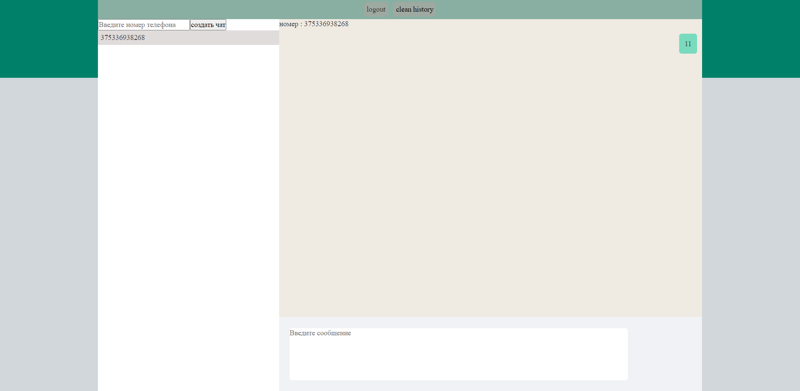

# Краткое описание

Пользователь переходит на сайт чата и вводит свои учетные данные из
системы GREEN-API (idInstance, apiTokenInstance)
• Пользователь вводит номер телефона получателя и создает новый чат
• Пользователь пишет текстовое сообщение и отправляет его получателю в
WhatsApp
• Получатель отвечает на сообщение в мессенджере WhatsApp
• Пользователь видит ответ получателя в чате

## Принцып работы

Для работы приложения необходимы idInstance, apiTokenInstance.
Получить их возможно используя https://green-api.com/
Ползьователь вводит номер телефона, после чего создается чат с данным абонентом.
Обновления чата происходит каждую секунду.
Сообщения а также idInstance, apiTokenInstance сохраняются в localstorage
Очисту чата можно осуществить нажав на кнопку "clean history"
Сменить idInstance, apiTokenInstance можно путем нажатия на кнопку logout

### Ссылка не деплой

https://creative-nasturtium-7abde2.netlify.app/

#### Скриншоты

##### Инструкцию для локального запуска

Для локального запуска приложения необходимо

1. Склонировать ребозиторий https://github.com/retrosexyal/green-api.git
2. Установить необходимые модули при помощи npm i
3. Запустить скрипт npm start
